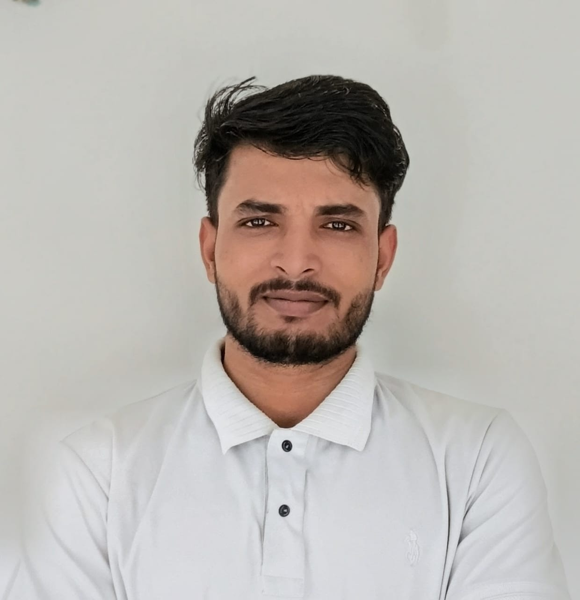

# ⚡ Hello World, I'm VIKAS VERMA! 🚀

<table align="center" width="100%">
  <tr>
    <td align="center" width="30%">
      <!-- PROFILE IMAGE HEADSHOT GRID -->
      
    </td>
    <td align="left" width="70%">
      <h3>👋 Welcome to my digital workspace!</h3>
      

        
      

      

        An ambitious Software Engineer specializing in Artificial Intelligence, combining deep technical system architectures with practical full-stack industry experience. Driven by optimizing complex algorithmic pipelines and building production-grade user experiences.
      

      

        
        
        
      

    </td>
  </tr>
</table>

---

## 🎓 Academic Journey & Institutional Focus

*   **🏫 Institution:** Galgotias College of Engineering & Technology (GCET) 
*   **🎓 Department:** Computer Science Engineering — Specializing in Artificial Intelligence (CSAI)
*   **📅 Timeline:** 2023 – 2027
*   **📊 Current Performance Baseline:** 70% aggregate score
*   **👥 Leadership Role:** Appointed as **Technical Team Captain**. Directed student developer sprints across 10 certified nationwide hackathons, handling real-time project pitches, architecture specifications, and data design

---

## 💼 Core Software Engineering Industry Experience

### 🚀 **Full Stack Developer Intern** | *Digital Blink*  
*(Oct 2025 – Dec 2025)*
*   **Responsive Application Architecture:** Built and maintained fully fluid web applications utilizing HTML5, CSS3, JavaScript, and modern layout conventions.
*   **Database & Systems Engineering:** Handled database management tasks and server integrations using SQL architectures.
*   **Version Pipelines:** Managed system versions, codebase integrity, branching, and multi-developer merging via robust **Git** and **GitHub** protocols.
*   **Cross-Functional Collaboration:** Partnered with software engineers to write clean, modular components adhering to secure software engineering lifecycle standards.

---

## 🛠️ Comprehensive Technical Stack Matrix

### 🌐 Core Web & Client-Side Engineering

  
  
  
  
  
  

### ⚙️ Back-End & Data System Architecture

  
  
  
  
  
  

### 🗄️ Database, Infrastructure & DevOps Tools

  
  
  
  
  
  

---

## 🏆 Key Achievements & Certifications

*   🏅 **National Hackathon Accolades:** Recognized across premier academic and tech hubs including **IIT Guwahati**, **IIT Ropar**, and **STPI** for performance metrics in competitive development.
*   📈 **Global Coding Merit Badge:** Awarded the Global Coding Merit Certificate by Unstop.
*   📊 **Data Analytics Training:** Certified in the **IIT Guwahati Power BI Workshop**, focusing on structuring tables, data transformation routines, and complex analytics mapping.
*   🤖 **GenAI & AI Agent Labs:** Actively engineering automation prompts and multi-agent systems via OpenAI API mechanics.

---

## 📊 Developer Metrics & Streak Stats

  
  

  

---

## 🕹️ Beyond the IDE

*   🎨 **UI/UX Strategy:** Writing technical blogs mapping patterns in automated systems and clean minimalist layouts.
*   ♟️ **Strategic Chess:** Playing tactical real-time chess to sharpen pattern recognition algorithms.
*   💪 **Calisthenics:** Dedicated to physical fitness and functional training routines.

